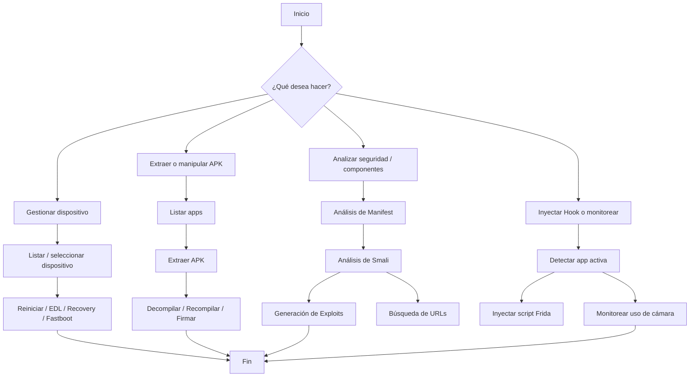

# 📱 IntelApp – Android Pentest & Management Toolkit

**IntelApp** es una suite avanzada en Python que proporciona herramientas para análisis estático, pruebas de penetración, depuración, ingeniería inversa y administración de dispositivos Android mediante ADB y Fastboot.

Diseñado para analistas, desarrolladores y pentesters, combina automatización con potencia analítica para facilitar tareas complejas en pocos pasos.

---

## ✨ Características Principales

### 🔹 Gestión de Dispositivos
- Detección automática de dispositivos ADB y Fastboot
- Selección interactiva del dispositivo
- Reinicio en modos: Recovery, Fastboot, EDL
- Desconexión de ADB sobre WiFi

### 📦 Gestión de Aplicaciones
- Listado completo de apps instaladas
- Extracción y reinstalación de APKs
- Limpieza de datos y cierre forzado de apps
- Revisión de `allowBackup` para extracción de datos
- Lanzamiento automático (`monkey`)

### 🧱 Manipulación de APKs
- Firma de APKs con `uber-apk-signer`
- Decompilación / Recompilación con `apktool`
- Instalación directa desde consola

### 🔍 Análisis Estático de APK
#### 🔧 APK Components Inspector
- Análisis completo de `AndroidManifest.xml`
- Detección de:
  - Actividades, Servicios, Receptores, Proveedores exportados
  - Permisos requeridos
  - Intents, filtros y `extras` esperados
  - `ContentProviders` y URIs
- Análisis de archivos `.smali`
- Detección de operaciones (query, insert, delete...) y columnas

#### 🧪 Generación de Comandos ADB
- Comandos listos para pruebas:
  - `am start`, `am broadcast`, `startservice`, `content query/insert/delete`
  - Inclusión automática de `extras` y `intents`
- Simulación de ataques y pruebas fuzzing

#### 🌐 Búsqueda de URLs
- Escaneo profundo de strings en APK decompilado
- Detección de endpoints HTTP/HTTPS incluyendo dominios personalizados
- Exportación de resultados en `.txt` y `.json`

### 🧪 Seguridad y Pruebas
- Verificación de acceso root (`su`)
- Desactivación temporal de SELinux
- Volcado de memoria RAM desde `/dev/mem`
- Desactivación de verificación de instalación de apps (bypass)

### ⚙️ Modo Fastboot
- Listado y análisis de dispositivos Fastboot
- (Des)bloqueo de Bootloader
- Flash de recovery personalizado
- Limpieza de partición userdata
- Envío a modo EDL

### 📷 Monitoreo y Hooking
- Escucha activa de `logcat` para uso de cámara
- Inyección de scripts Frida en la app activa en foreground

---

## 📈 Eficiencia

- Modularidad total: cada función se puede usar de forma independiente.
- Alto rendimiento en análisis de componentes (`< 5s` en APK promedio).
- Diseño robusto y multihilo (logcat en segundo plano, Frida inyectado con `Popen`).
- Limpieza automática de temporales tras análisis (`cleanup=True`).

---

## 🧭 Diagrama de Flujo – Proceso General



---

## 🎯 Propósito de IntelApp

**IntelApp** fue diseñado con los siguientes fines:

- 🕵️ Análisis forense móvil  
- 🔓 Auditoría de seguridad de aplicaciones Android
- 🛠️ Ingeniería inversa de APKs
- 🧪 Pruebas de fuzzing e intent spoofing
- 📶 Gestión avanzada de dispositivos para análisis técnico
- 🔬 Investigación de malware, spyware y apps sospechosas

---

## 📌 Casos de Uso / Ejemplos

### 1. Análisis de componentes vulnerables
```bash
adb shell am start -n com.ejemplo/.ActivityExportada --es secretKey "admin123"
```

### 2. Buscar URLs sensibles
```bash
https://api.invertironline.com/login
http://dev.iolinversiones.com/test
```

### 3. Volcado de RAM (requiere root)
```bash
Archivo generado en /sdcard/ramdump.bin
```

### 4. Monitorear uso de cámara
```bash
[🎥] 15:02:12 Camera opened: com.spyapp.CameraService
```

### 5. Inyección Frida para análisis dinámico
```bash
frida -U -n com.target.app -l hook.js --no-pause
```

---

## 🧬 Aplicaciones en Ingeniería Inversa

- Análisis de permisos no documentados
- Estudio de comportamiento en tiempo de ejecución
- Identificación de lógica ofuscada o funciones escondidas
- Inspección de operaciones de ContentProvider
- Descubrimiento de componentes exportados inadvertidamente

 
